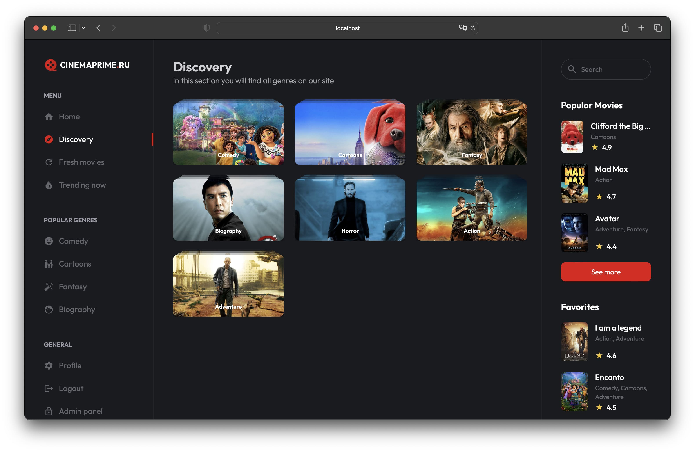

# Cinema

«Cinema» —  is an online cinema with the ability to watch movies, register for rating and adding movies to favorites, profile, admin panel for adding content to the site.

### Technology stack:
- React
- Next.js
- TypeScript
- React Query (TanStack Query)
- React Hook Form
- Redux Toolkit
- Axios
- Tailwind
- React-Select
- Draft.js

## Index:

## Movie:

## Discovery:

## Admin Panel (Statistics):

## Admin Panel (Movies):

## Admin Panel (Edit Movie):

## Auth:

## Profile:

